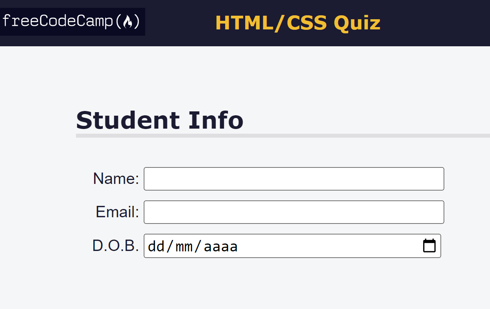

<h1 align="center"> HTML/CSS Webpage Quiz </h1>

 

  

## 🚀 Tecnologias

Esse projeto foi desenvolvido com as seguintes tecnologias:

- HTML
- CSS 

## 💻 Projeto

Accessibility is making your webpage easy for all people to use – even people with disabilities.

---

No Copyright :wave: by https://www.freecodecamp.org

- [Acesse o projeto finalizado, online](https://rodrigocccesar.github.io/front-end_quiz)

